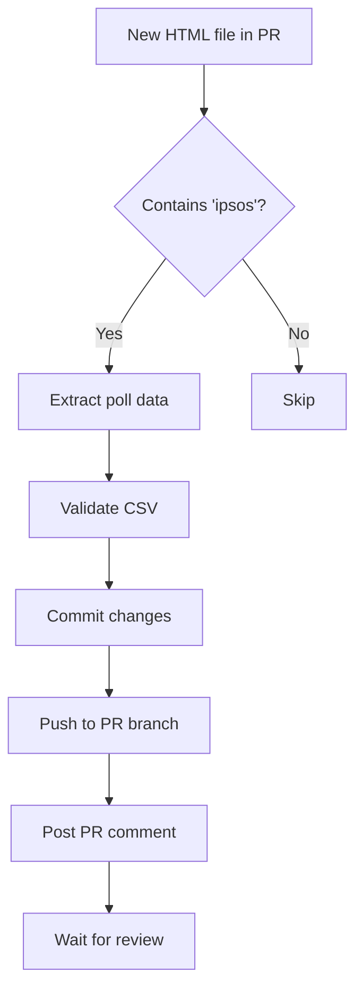
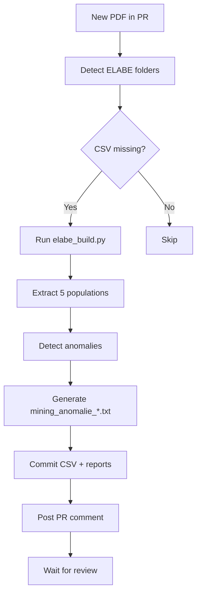

# GitHub Actions - Automated Workflows

This directory contains GitHub Actions workflows for automating poll data extraction and processing.

## 🤖 auto-extract-ipsos.yml

Automatically extracts IPSOS poll data when new HTML source files are added to the repository.

### Triggers

- **Pull Request**: When HTML files are added/modified in `polls/**/` directories
- **Push to main**: When HTML files are added/modified in `polls/**/` directories

### What it does

1. **Detects IPSOS files**
   - Scans for new `.html` files in the `polls/` folder
   - Filters for files containing "ipsos" in the path/name

2. **Extracts poll data**
   - Runs `mining/mining_IPSOS/extract_ipsos_from_html.py` automatically
   - Generates CSV files with candidate data
   - Adds metadata entries to `polls.csv`
   - Infers survey dates from folder names (e.g., `ipsos_202511` → 2025-11-15)

3. **Validates extracted data**
   - Runs `mining/mining_IPSOS/validate_poll.py`
   - Checks CSV structure, candidate IDs, and percentages
   - Reports validation results

4. **Commits changes**
   - Commits generated CSV files and `polls.csv` updates
   - Pushes to the PR branch automatically
   - Uses `github-actions[bot]` as author

5. **Posts PR comment** (on Pull Requests)
   - Summary of extraction results
   - Number of candidates extracted
   - polls.csv entries added
   - **Warning to verify survey dates**
   - Next steps checklist

### Example PR Comment

```markdown
# 🤖 IPSOS Poll Auto-Extraction

## Extraction Results

### 📊 Processing: `polls/ipsos_202511/source.html`
✅ **Extraction successful**

- **Candidates extracted**: 28
- **CSV file**: `polls/ipsos_202511/ipsos_202511_all.csv`
- **polls.csv entry**: `ipsos_202511,pt1,1000,2025-11-15,2025-11-15,polls/ipsos_202511,all`

⚠️ **Please verify survey dates**: `2025-11-15` to `2025-11-15`
   (Dates were inferred from folder name. Check the original IPSOS report.)

## 🔍 Validation Results

### Validating `polls/ipsos_202511/ipsos_202511_all.csv`
✅ **Validation passed**

---

## 📋 Next Steps

1. **Verify survey dates** in `polls.csv`
   - Dates are inferred from folder names (mid-month default)
   - Check the original IPSOS report for exact dates
   - Edit `polls.csv` if needed

2. **Review extracted data**
   - Check CSV files for accuracy
   - Verify candidate mappings

3. **Run merge**
   - After verifying dates, run `python merge.py` locally
   - Or wait for the merge workflow to run automatically

4. **Approve and merge** when ready ✅
```

### Workflow Steps



### Requirements

- Python 3.11+
- No external dependencies (uses stdlib only)
- Write access to repository
- Pull request permissions

### Configuration

The workflow uses these files:
- `mining/mining_IPSOS/extract_ipsos_from_html.py` - Extraction script
- `mining/mining_IPSOS/validate_poll.py` - Validation script
- `candidates.csv` - Candidate mapping (65 candidates)
- `polls.csv` - Poll metadata database

### Permissions

```yaml
permissions:
  contents: write        # To commit and push changes
  pull-requests: write   # To post comments on PRs
```

### Usage

1. **Add IPSOS HTML source file** to a PR:
   ```bash
   mkdir -p polls/ipsos_202512
   # Download HTML from IPSOS
   cp ~/Downloads/source.html polls/ipsos_202512/
   git add polls/ipsos_202512/source.html
   git commit -m "Add IPSOS December 2025 poll source"
   git push
   ```

2. **GitHub Action runs automatically**:
   - Extracts data within ~30 seconds
   - Commits CSV files and polls.csv
   - Posts PR comment with results

3. **Review the PR comment**:
   - Check extraction summary
   - Verify survey dates (⚠️ inferred from folder name)
   - Edit `polls.csv` if dates need adjustment

4. **Approve and merge**:
   - When dates are verified
   - CSV files look correct
   - Validation passed

### Troubleshooting

#### "No IPSOS HTML files detected"
- Check that the file is in `polls/**/` directory
- Check that filename or path contains "ipsos"
- Ensure file extension is `.html`

#### "Extraction failed"
- Check the error message in the PR comment
- Common issues:
  - Candidate not in `candidates.csv` - add them first
  - HTML format changed - update extraction script
  - Invalid folder name format

#### "Validation warnings"
- Check the validation output in the PR comment
- Fix issues in the generated CSV or `polls.csv`
- Re-run by pushing another commit

### Manual Override

If the action fails, you can run manually:

```bash
# Extract
python mining/mining_IPSOS/extract_ipsos_from_html.py polls/ipsos_YYYYMM/source.html

# Validate
python mining/mining_IPSOS/validate_poll.py polls/ipsos_YYYYMM/ipsos_YYYYMM_all.csv

# Commit
git add polls/ polls.csv
git commit -m "Add IPSOS poll YYYYMM"
git push
```


## 🤖 auto-extract-elabe.yml

Automatically extracts ELABE poll data when new PDF source files are added to the repository.

### Triggers

- **Pull Request**: When PDF files or metadata are added/modified in `polls/elabe_*/` directories

### What it does

1. **Detects ELABE PDFs**
   - Scans for `source.pdf` files in `polls/elabe_*/` folders
   - Checks if corresponding CSV files are missing (any of the 5 required files)

2. **Extracts poll data**
   - Runs `mining/mining_ELABE/elabe_build.py` automatically
   - Generates **5 CSV files** per poll:
     - `elabe_YYYYMM_all.csv` - Ensemble des Français
     - `elabe_YYYYMM_left.csv` - Électeurs de gauche
     - `elabe_YYYYMM_macron.csv` - Électeurs d'Emmanuel Macron
     - `elabe_YYYYMM_farright.csv` - Électeurs d'extrême droite
     - `elabe_YYYYMM_absentionists.csv` - Abstentionnistes

3. **Detects anomalies**
   - Identifies missing candidates (< 100% total)
   - Identifies incorrect scores (sum ≠ 100%)
   - Generates `mining_anomalie_*.txt` reports for each population

4. **Commits changes**
   - Commits all 5 CSV files
   - Commits anomaly reports (`mining_anomalie_*.txt`)
   - Uses `github-actions[bot]` as author

5. **Posts PR comment**
   - Summary of extraction results (success/fail per poll)
   - Anomaly warnings with counts per population
   - Link to anomaly report files for review

### Example PR Comment

```markdown
## 🤖 ELABE Extraction Results

### Extraction Summary

✅ **elabe_202511**: Extraction successful
✅ **elabe_202510**: Extraction successful

### ⚠️ Anomalies Detected

⚠️ **elabe_202511** (all): 1 anomalies
⚠️ **elabe_202511** (left): 3 anomalies
⚠️ **elabe_202510** (macron): 2 anomalies

> **Note**: Anomaly reports have been saved in the poll folders as `mining_anomalie_*.txt`. 
> Please review these files to identify missing or incorrect data.

___
✅ CSV files have been automatically generated and committed.
Generated by: [`auto-extract-elabe.yml`](/.github/workflows/auto-extract-elabe.yml)
```

### Workflow Steps



### Requirements

- Python 3.13
- `pdfminer.six` (installed automatically)
- `mining/mining_ELABE/` module (ElabeMiner, PageDetector, ElabeBuilder, AnomalyDetector)
- Write access to repository

### Configuration

The workflow uses these files:
- `mining/mining_ELABE/elabe_build.py` - Main CLI script
- `mining/mining_ELABE/elabe_miner.py` - PDF extraction engine
- `mining/mining_ELABE/elabe_builder.py` - CSV builder
- `mining/mining_ELABE/page_detector.py` - Auto page detection
- `mining/mining_ELABE/anomaly_detector.py` - Anomaly detection
- `candidates.csv` - Candidate validation

### Permissions

```yaml
permissions:
  contents: write        # To commit and push changes
  pull-requests: write   # To post comments on PRs
  issues: write          # To create issues if needed
```

### Usage

1. **Add ELABE PDF source file** to a PR:
   ```bash
   mkdir -p polls/elabe_202512
   # Download PDF from ELABE (usually via auto-scrape-elabe.yml)
   cp ~/Downloads/source.pdf polls/elabe_202512/
   echo "..." > polls/elabe_202512/metadata.txt
   git add polls/elabe_202512/
   git commit -m "Add ELABE December 2025 poll source"
   git push
   ```

2. **GitHub Action runs automatically**:
   - Extracts data within ~1-2 minutes (5 populations)
   - Commits 5 CSV files
   - Generates anomaly reports if issues detected
   - Posts PR comment with results

3. **Review the PR comment**:
   - Check extraction success/failure
   - Review anomaly warnings
   - Open `mining_anomalie_*.txt` files to see details

4. **Fix anomalies if needed**:
   - Check the anomaly report files
   - Manually add missing candidates to CSV
   - Or accept partial extraction if candidates are irrelevant

5. **Approve and merge**:
   - When extraction is satisfactory
   - Anomalies are reviewed/fixed
   - CSV files look correct

### Troubleshooting

#### "No ELABE folders need extraction"
- Check that `source.pdf` exists in `polls/elabe_*/`
- Ensure at least one CSV file is missing (all, left, macron, farright, absentionists)
- Workflow only runs if CSV files are incomplete

#### "Extraction failed"
- Check the error message in PR comment
- View workflow logs in GitHub Actions tab
- Common issues:
  - PDF format changed (different pages, layout)
  - Candidate names not recognized
  - pdfminer.six version incompatible

#### "Many anomalies detected"
- This is **normal** for ELABE polls (partial data common)
- Review `mining_anomalie_*.txt` files
- Check if missing candidates are important
- Example: Sept 2025 had only 7/32 candidates → 25 anomalies (expected)

#### "Scores don't sum to 100%"
- ELABE format sometimes has 4 scores instead of 5
- Anomaly detector flags these cases
- Review manually to confirm if acceptable

### Manual Override

If the action fails, you can run manually:

```bash
cd mining/mining_ELABE

# Extract (replace YYYYMM with actual date)
python3 elabe_build.py ../../polls/elabe_YYYYMM/source.pdf YYYYMM --overwrite

# Check anomalies
ls -la ../../polls/elabe_YYYYMM/mining_anomalie_*.txt
cat ../../polls/elabe_YYYYMM/mining_anomalie_all.txt

# Verify CSVs
wc -l ../../polls/elabe_YYYYMM/*.csv

# Commit
cd ../..
git add polls/elabe_YYYYMM/
git commit -m "Extract ELABE YYYYMM poll data"
git push
```

### Format Compatibility

The extraction system works with:
- ✅ **October-November 2025 format**: Pages 13-17 or 17-21, 30 candidates/page, 5 scores

## See Also

- [Mining IPSOS Documentation](../mining/mining_IPSOS/README.md)
- [Mining ELABE Documentation](../mining/mining_ELABE/README.md)
- [COMMENT_AJOUTER_UN_SONDAGE.md](../COMMENT_AJOUTER_UN_SONDAGE.md)